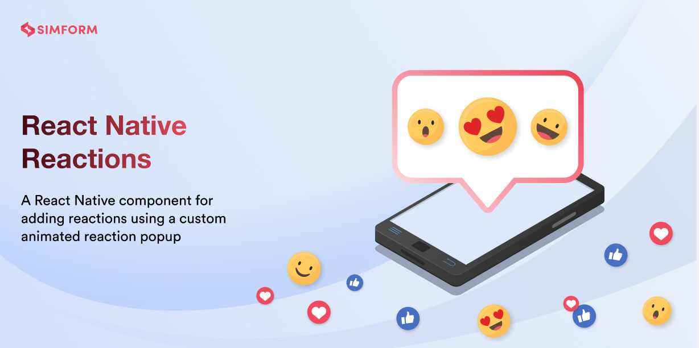
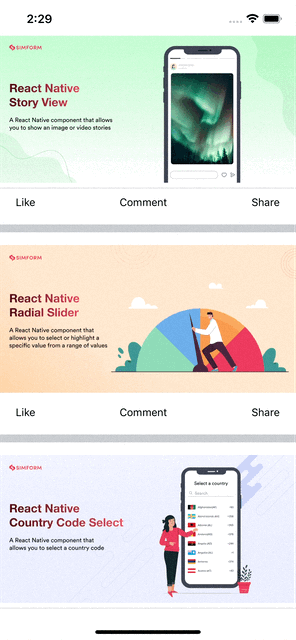
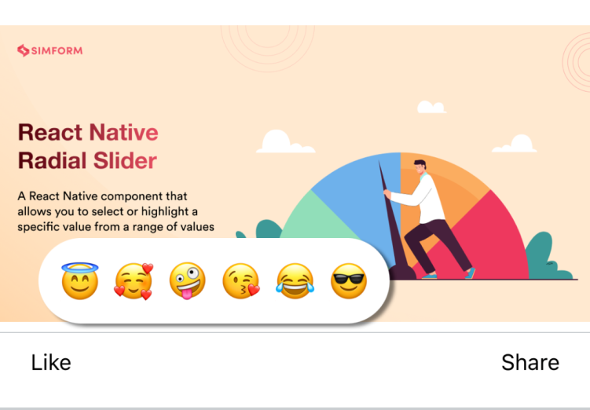

# react-native-reactions

[](https://www.npmjs.com/package/react-native-reactions) [](https://www.npmtrends.com/react-native-reactions) [](https://packagephobia.com/result?p=react-native-reactions) [](https://www.android.com) [](https://developer.apple.com/ios) [](https://opensource.org/licenses/MIT)

---

This is a pure javascript and react-native-reanimated based library that provides reaction feature like Instagram/WhatsApp or other social media.

It is simple to use and fully customizable. It works on both android and iOS platforms.

---

## 🎬 Preview

---

| Default                              | Custom                            |
| ------------------------------------ | --------------------------------- |
|  |  |

---

## Quick Access

[Installation](#installation) | [Reaction](#reaction) | [Properties](#properties) | [Example](#example) | [License](#license)

# Installation

##### 1. Install library and react-native-reanimated

```bash
npm install react-native-reactions react-native-reanimated
```

###### --- or ---

```bash
yarn add react-native-reactions react-native-reanimated
```

##### 2. Install cocoapods in the ios project

```bash
cd ios && pod install
```

> Note: Make sure to add Reanimated's babel plugin to your `babel.config.js`

```
module.exports = {
      ...
      plugins: [
          ...
          'react-native-reanimated/plugin',
      ],
  };
```

##### Know more about [react-native-reanimated](https://www.npmjs.com/package/react-native-reanimated)

---

# Reaction

- Reaction component has two different variants
  - Default reaction: This variant of reaction is based on an absolute view
  - Modal reaction: This variant of reaction is based on a Modal view
- To avoid the zIndex/Overlap issue, you can use modal variant of reaction component instead of the default

#### 🎬 Preview

## 

### ReactionItems

```jsx
const ReactionItems = [
  {
    id: string,
    emoji: element | string | url,
    title: string,
  },
];
```

### Emoji Data Format

```jsx
const ReactionItems = [
  {
    id: 0,
    emoji: '😇',
    title: 'like',
  },
  {
    id: 1,
    emoji: '🥰',
    title: 'love',
  },
  {
    id: 2,
    emoji: '🤗',
    title: 'care',
  },
  {
    id: 3,
    emoji: '😘',
    title: 'kiss',
  },
  {
    id: 4,
    emoji: '😂',
    title: 'laugh',
  },
  {
    id: 5,
    emoji: '😎',
    title: 'cool',
  },
];
```

## Default Reaction

---

#### 🎬 Preview

## 

#### Usage

```jsx
const ReactionItem = () => {
  const [selectedEmoji, setSelectedEmoji] = useState();
  return (
    <View>
      <Reaction items={ReactionItems} onTap={setSelectedEmoji}>
        <Text>{selectedEmoji ? selectedEmoji?.emoji : 'Like'}</Text>
      </Reaction>
    </View>
  );
};
```

---

> Note: To improve the performance with Flatlist, consider wrapping your renderItem with memo. Additionally, pass state variable that will be used to manage the scroll enabled property of the Flatlist. This can further optimize the rendering of entire list.
>
> You're not sure what this means, take a look at this [example card](./example/src/component/Card/Card.tsx)

---

##### App

```jsx
import React, { useState } from 'react';
import { FlatList, SafeAreaView, StyleSheet } from 'react-native';
import { Card } from './component';

const PostItemList = [
  {
    id: 'bd7acbea-c1b1-46c2-aed5-3ad53abb28ba',
    title: 'First Item',
    image:
      'https://raw.githubusercontent.com/SimformSolutionsPvtLtd/react-native-story-view/main/assets/banner.png',
  },
  {
    id: '3ac68afc-c605-48d3-a4f8-fbd91aa97f63',
    title: 'Second Item',
    image:
      'https://raw.githubusercontent.com/SimformSolutionsPvtLtd/react-native-radial-slider/main/assets/banner.png',
  },
  {
    id: '58694a0f-3da1-471f-bd96-145571e29d72',
    title: 'Third Item',
    image:
      'https://raw.githubusercontent.com/SimformSolutionsPvtLtd/react-native-country-code-select/main/assets/banner.png',
  },
];

const App = () => {
  const [isScrollEnable, setIsScrollEnable] = useState(true);
  return (
    <SafeAreaView style={styles.mainStyle}>
      <FlatList
        data={PostItemList}
        style={styles.flatlistStyle}
        scrollEnabled={isScrollEnable}
        renderItem={({ index, item }) => (
          <Card
            index={index}
            {...item}
            onShowDismissCard={(e?: boolean) => setIsScrollEnable(!e)}
            isScrollEnable
          />
        )}
        keyExtractor={item => item?.id}
      />
    </SafeAreaView>
  );
};

export default App;

const styles = StyleSheet.create({
  mainStyle: {
    flex: 1,
  },
  flatlistStyle: {
    backgroundColor: '#c9cdd0',
  },
});
```

##### Card

```jsx

import {Image, StyleSheet, Text, View} from 'react-native';
import React, {memo, useState} from 'react';
import {Reaction} from 'react-native-reactions';
import _ from 'lodash';

interface EmojiItemProp {
  id: number;
  emoji: React.ReactNode | string | number;
  title: string;
}

interface CardProps extends CardItemsProps {
  index?: number;
  selectedEmoji?: EmojiItemProp;
  setSelectedEmoji?: (e: EmojiItemProp | undefined) => void;
  onShowDismissCard?: (e?: boolean) => void;
  isScrollEnable?: boolean;
}

interface CardItemsProps {
  id?: string;
  image?: string;
  title?: string;
}

const ReactionItems = [
  {
    id: 0,
    emoji: '😇',
    title: 'like',
  },
  {
    id: 1,
    emoji: '🥰',
    title: 'love',
  },
  {
    id: 2,
    emoji: '🤗',
    title: 'care',
  },
  {
    id: 3,
    emoji: '😘',
    title: 'kiss',
  },
  {
    id: 4,
    emoji: '😂',
    title: 'laugh',
  },
  {
    id: 5,
    emoji: '😎',
    title: 'cool',
  },
];

const Card = ({index, onShowDismissCard, ...item}: CardProps) => {
  const [selectedEmoji, setSelectedEmoji] = useState<EmojiItemProp>();

  return (
    <View style={styles.cardContainer}>
      <View style={styles.postImageContainer}>
        <Image source={{uri: item?.image}} style={styles.postImage} />
      </View>
      <View style={styles.line} />
      <View style={styles.bottomContainer}>
        <Reaction
          items={ReactionItems}
          onTap={setSelectedEmoji}
          itemIndex={index}
          onShowDismissCard={onShowDismissCard}>
          <Text>{selectedEmoji ? selectedEmoji?.emoji : 'Like'}</Text>
        </Reaction>
        <Text>Share</Text>
      </View>
    </View>
  );
};

export default memo(Card, (prevProps, nextProps) =>
  _.isEqual(prevProps?.isScrollEnable, nextProps?.isScrollEnable),
);

const styles = StyleSheet.create({
  cardContainer: {
    marginVertical: 5,
    backgroundColor: '#FFFFFF',
  },
  postImageContainer: {
    alignItems: 'center',
    zIndex: -1,
  },
  postImage: {
    width: '100%',
    height: 200,
    zIndex: -1,
    resizeMode: 'center',
  },
  line: {
    borderWidth: 0.3,
    borderColor: '#c9cdd0',
  },
  bottomContainer: {
    flexDirection: 'row',
    justifyContent: 'space-between',
    margin: 10,
    marginHorizontal: 20,
  },
});

```

---

## Modal Reaction

- Modal reaction variant can be used to avoid the zIndex / Overlap issue on reaction popup

> Note: Make sure to wrap your root component with ReactionProvider

```bash
import { ReactionProvider } from 'react-native-reactions';
export default const App = () => {
  return <ReactionProvider>{/* content */}</ReactionProvider>;
}
```

#### 🎬 Preview

## 

#### Usage

---

##### App.tsx

Use the above [App](#app) example but the only change here is to wrap the root component with ReactionProvider.

```jsx
import { ReactionProvider } from 'react-native-reactions';

<ReactionProvider>
  <SafeAreaView style={styles.mainStyle}>
    <FlatList
      data={PostItemList}
      style={styles.flatlistStyle}
      scrollEnabled={isScrollEnable}
      renderItem={({ index, item }) => (
        <Card
          index={index}
          {...item}
          onShowDismissCard={(e?: boolean) => setIsScrollEnable(!e)}
          isScrollEnable
        />
      )}
      keyExtractor={item => item?.id}
    />
  </SafeAreaView>
</ReactionProvider>;
```

##### Card.tsx

Use the above [Card](#card) example but the only change here is to set type as modal.

```jsx
<Reaction
  items={ReactionItems}
  onTap={setSelectedEmoji}
  itemIndex={index}
  onShowDismissCard={onShowDismissCard}>
  <Text>{selectedEmoji ? selectedEmoji?.emoji : 'Like'}</Text>
</Reaction>
```

---

# Properties

---

| Prop                | Default                         | Type      | Description                                                                                                                                                                                                                       |
| :------------------ | :------------------------------ | :-------- | :-------------------------------------------------------------------------------------------------------------------------------------------------------------------------------------------------------------------------------- |
| type                | default                         | string    | Different type of component like default and modal                                                                                                                                                                                |
| items               | [ReactionItems](#reactionitems) | array     | Array of reaction emojis                                                                                                                                                                                                          |
| disabled            | false                           | boolean   | If true, disable all interactions for this component                                                                                                                                                                              |
| showPopupType       | default                         | string    | Pressable showPopupType like default and onPress<br />- If showPopupType is default, then reaction popup will be shown on onLongPress only<br /> - If showPopupType is onPress, then reaction popup will be shown on onPress only |
| onPress             | -                               | function  | Callback function that triggers when the wrapped element is pressed                                                                                                                                                               |
| onLongPress         | -                               | function  | Callback function that triggers when the wrapped element is long pressed                                                                                                                                                          |
| onTap               | -                               | function  | Callback function that returns selected emoji                                                                                                                                                                                     |
| cardStyle           | {}                              | ViewStyle | Card modal style                                                                                                                                                                                                                  |
| emojiStyle          | {}                              | TextStyle | Emoji style                                                                                                                                                                                                                       |
| onShowDismissCard   | -                               | function  | Callback function that returns reaction card popup status (true / false)                                                                                                                                                          |
| isShowCardInCenter  | false                           | boolean   | If true, Show card in center                                                                                                                                                                                                      |
| iconSize            | 25                              | number    | Size of emoji. It should be in between 15 to 30.                                                                                                                                                                                  |
| titleStyle          | {}                              | TextStyle | Title style for emoji                                                                                                                                                                                                             |
| titleBoxStyle       | {}                              | ViewStyle | Title box style                                                                                                                                                                                                                   |
| emojiContainerStyle | {}                              | ViewStyle | Emoji container style                                                                                                                                                                                                             |
| cardDuration        | 150                             | number    | Card animation duration                                                                                                                                                                                                           |
| opacityRange        | [0, 0, 1]                       | array     | Opacity range for card container (`note`: opacity range must be in ascending order)                                                                                                                                               |
| emojiDuration       | 200                             | number    | Emoji animation duration                                                                                                                                                                                                          |
| scaleDuration       | 100                             | number    | Scale animation duration                                                                                                                                                                                                          |

---

# Example

A full working example project is here [Example](./example/src/App.tsx)

```sh
yarn
yarn example ios   // For ios
yarn example android   // For Android
```

# TODO

- [ ] Customize Emoji (Add more emoji options)
- [ ] Landscape support

## Find this library useful? ❤️

Support it by joining [stargazers](https://github.com/SimformSolutionsPvtLtd/react-native-reactions/stargazers) for this repository.⭐

## Bugs / Feature requests / Feedbacks

For bugs, feature requests, and discussion please use [GitHub Issues](https://github.com/SimformSolutionsPvtLtd/react-native-reactions/issues/new?labels=bug&late=BUG_REPORT.md&title=%5BBUG%5D%3A), [GitHub New Feature](https://github.com/SimformSolutionsPvtLtd/react-native-reactions/issues/new?labels=enhancement&late=FEATURE_REQUEST.md&title=%5BFEATURE%5D%3A), [GitHub Feedback](https://github.com/SimformSolutionsPvtLtd/react-native-reactions/issues/new?labels=enhancement&late=FEATURE_REQUEST.md&title=%5BFEEDBACK%5D%3A)

## 🤝 How to Contribute

We'd love to have you improve this library or fix a problem 💪
Check out our [Contributing Guide](CONTRIBUTING.md) for ideas on contributing.

## Awesome Mobile Libraries

- Check out our other [available awesome mobile libraries](https://github.com/SimformSolutionsPvtLtd/Awesome-Mobile-Libraries)

## License

- [MIT License](./LICENSE)
