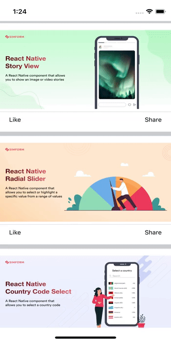
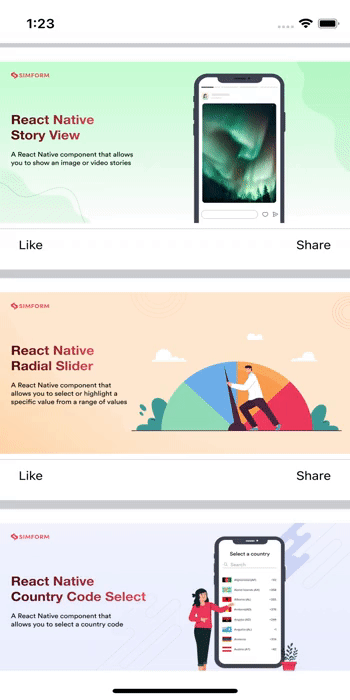

# react-native-reactions
[](https://www.npmjs.org/package/react-native-country-code-select) [](https://www.android.com) [](https://developer.apple.com/ios) [](https://opensource.org/licenses/MIT)

---
This is a pure javascript and react-native-reanimated based library that provides two types of reactions including default and modal.

This library provides emoji reactions features like Instagram/WhatsApp or other social media, It is simple to use and fully customizable. It works on both android and iOS platforms.

---
## 🎬 Preview

---

| Default                                          | Modal                                        |
| ----------------------------------------------------- | -------------------------------------------------- |
|  |  |

---

## Quick Access

[Installation](#installation) | [Reactions](#reactions) | [Properties](#properties) | [Example](#example) | [License](#license) 

# Installation

##### 1. Install library and react-native-reanimated

```bash
$ npm install react-native-reactions react-native-reanimated
# --- or ---
$ yarn add react-native-reactions react-native-reanimated
```

##### 2. Install cocoapods in the ios project

```bash
cd ios && pod install
```

> Note: Make sure to add Reanimated's babel plugin to your `babel.config.js`

```
module.exports = {
      ...
      plugins: [
          ...
          'react-native-reanimated/plugin',
      ],
  };
```

##### Know more about [react-native-reanimated](https://www.npmjs.com/package/react-native-reanimated)
---

# Reactions
- Reactions has two different types, default one and modal
- To avoid the zIndex/Overlap issue, you can use modal instead of the default.

#### 🎬 Preview

---
### Emoji Data Format

```
 const ReactionItems = [
    {
        id: 0, emoji: '😇', title: 'like'
    },
    {
        id: 1, emoji: '🥰', title: 'love'
    },
    {
        id: 2, emoji: '🤗', title: 'care'
    },
    {
        id: 3, emoji: '😘', title: 'kiss'
    },
    {
        id: 4, emoji: '😂', title: 'laught'
    },
    {
        id: 5, emoji: '😎', title: 'cool'
    },
];

```
## Default Reactions
---
#### 🎬 Preview

---

#### Usage

---

##### App
```jsx

import React from 'react';
import { FlatList, SafeAreaView, StyleSheet } from 'react-native';
import { Card } from './component';

const PostItemList = [
    {
      id: 'bd7acbea-c1b1-46c2-aed5-3ad53abb28ba',
      title: 'First Item',
      image:'https://raw.githubusercontent.com/SimformSolutionsPvtLtd/react-native-story-view/main/assets/banner.png',
    },
    {
      id: '3ac68afc-c605-48d3-a4f8-fbd91aa97f63',
      title: 'Second Item',
      image:'https://raw.githubusercontent.com/SimformSolutionsPvtLtd/react-native-radial-slider/main/assets/banner.png',
    },
    {
      id: '58694a0f-3da1-471f-bd96-145571e29d72',
      title: 'Third Item',
      image:'https://raw.githubusercontent.com/SimformSolutionsPvtLtd/react-native-country-code-select/main/assets/banner.png',
    },
  ];

const App = () => (
  <SafeAreaView style={styles.mainStyle}>
      <FlatList
        data={PostItemList}
        style={styles.flatlistStyle}
        renderItem={({ index,item }) => <Card index={index} {...item} />}
        keyExtractor={item => item?.id}
      />
  </SafeAreaView>
);

export default App;

const styles = StyleSheet.create({
  mainStyle: {
    flex: 1,
  },
  flatlistStyle: { 
    backgroundColor: '#c9cdd0', 
  }
});
```
##### Card
```jsx

import { Image, StyleSheet, Text, View } from 'react-native'
import React, { useState } from 'react'
import { Reaction } from 'react-native-reactions'

interface EmojiItemProp {
  id: number;
  emoji: React.ReactNode | string | number;
  title: string;
}

interface CardProps extends CardItemsProps {
  index?: number;
  selectedEmoji?: EmojiItemProp
  setSelectedEmoji?: (e: EmojiItemProp | undefined) => void;
}

interface CardItemsProps {
  id?: string;
  image?: string;
  title?: string;
}

const Card = ({ index, ...item }: CardProps) => {
    const [selectedEmoji, setSelectedEmoji] = useState<EmojiItemProp>();

    return (
        <View style={styles.cardContainer}>
            <View style={styles.postImageContainer}>
                <Image
                    source={{ uri: item?.image }}
                    style={styles.postImage}
                />
            </View>
            <View style={styles.line} />
            <View style={styles.bottomContainer} >
                <Reaction items={ReactionItems} onTap={setSelectedEmoji}>
                    <Text>{selectedEmoji ? selectedEmoji?.emoji : 'Like'}</Text>
                </Reaction>
                    <Text>Share</Text>
            </View>
        </View>
    )
}

export default Card

const styles = StyleSheet.create({
    cardContainer: {
        marginVertical: 5,
        backgroundColor: '#FFFFFF',
    },
    postImageContainer: {
        alignItems: 'center',
        zIndex: -1
    },
    postImage: {
        width: '100%',
        height: 200,
        zIndex: -1,
        resizeMode:'center',
    },
    line: {
        borderWidth: 0.3,
        borderColor: '#c9cdd0',
    },
    bottomContainer: {
        flexDirection: 'row',
        justifyContent: 'space-between',
        margin: 10,
        marginHorizontal: 20
    },

})

```

---


## Modal Reactions
-  Modal reaction variant can be used to avoid the zIndex / Overlap issue on reactions

> Note: Make sure to wrap your root component with ReactionProvider

```bash
import { ReactionProvider } from 'react-native-reactions';
export default const App = () => {
  return <ReactionProvider>{/* content */}</ReactionProvider>;
}
```

#### 🎬 Preview

---

#### Usage

---
##### App.tsx
 Use the above [App](#app) example but the only change is to wrap the root component with ReactionProvider.
```jsx
import { ReactionProvider } from 'react-native-reactions';

 <ReactionProvider>
    <SafeAreaView style={styles.mainStyle}>
      <FlatList
        data={PostItemList}
        style={{ backgroundColor: '#c9cdd0' }}
        renderItem={({ index, item }) => <Card index={index} {...item} />}
        keyExtractor={item => item?.id}
      />
    </SafeAreaView>
  </ReactionProvider>
```

##### Card.tsx
 Use the above [Card](#card) example but the only change is to set type as modal.
```jsx
  <Reaction type='modal' items={ReactionItems} onTap={setSelectedEmoji}>
    <Text>{selectedEmoji ? selectedEmoji?.emoji : 'Like'}</Text>
  </Reaction>
```
---
### ReactionItems

```
[
    {
        id:string,
        emoji: element | string | url,
        title: string
    }
]

```
# Properties
---


| Prop              | Default                        | Type     | Description  |
| :---------------- | :----------------------------- | :------- | :----------- | 
|type               | default                        | string   | Different type of component like default and modal |
|items              | [ReactionItems](#reactionitems)| array    | Array of reaction emojis |
|disable            | false                          | boolean  | If true, disable all interactions for this component  |
|variant            | default                        | string   | Pressable variants like default, onPress and onLongPress         |
|onPress            | -                              | function | This function called when wrapped element is pressed  |
|onLongPress        | -                              | function | This function called when wrapped element is long pressed  |
|onTap              | -                              | function | Callback function that returns selected emoji |
|cardStyle          | {}                             |ViewStyle | Card modal style|
|emojiStyle         | {}                             |TextStyle | Emoji style |
|emojiKey           | -                              |string    | Key name of reaction item array’s emoji field  |
|onShowDismissCard  | -                              |function  | Callback function that returns reaction card popup status (true / false)|
|isShowCardInCenter | false                          |boolean   | If true, Show card in center|
|iconSize           | 25                             |number    |Size of emoji. It should be in between 15 to 30.|
|titleStyle         | {}                             |TextStyle |Title style for emoji|
|titleBoxStyle      | {}                             |ViewStyle |Title box style|
|emojiContainerStyle| {}                             |ViewStyle |Emoji container style |
|cardDuration       | 400                            |number    |Card animation duration |
|opacityRange       | [0, 0, 1]                      |array     |Opacity range for card container |
|emojiDuration      | 200                            |number    |Emoji animation duration |
|scaleDuration      | 100                            |number    |Scale animation duration |

---

# Example

A full working example project is here [Example](./example/src/App.tsx)

```sh
$ yarn
$ yarn example ios   // For ios
$ yarn example android   // For Android
```

# TODO

- [ ] Customize Emoji (Add more emoji options)
- [ ] Improve gesture and select emoji in a Single gesture event
- [ ] Landscape support

## Find this library useful? ❤️

Support it by joining [stargazers](https://github.com/SimformSolutionsPvtLtd/react-native-reactions/stargazers) for this repository.⭐

## Bugs / Feature requests / Feedbacks

For bugs, feature requests, and discussion please use [GitHub Issues](https://github.com/SimformSolutionsPvtLtd/react-native-reactions/issues/new?labels=bug&late=BUG_REPORT.md&title=%5BBUG%5D%3A), [GitHub New Feature](https://github.com/SimformSolutionsPvtLtd/react-native-reactions/issues/new?labels=enhancement&late=FEATURE_REQUEST.md&title=%5BFEATURE%5D%3A), [GitHub Feedback](https://github.com/SimformSolutionsPvtLtd/react-native-reactions/issues/new?labels=enhancement&late=FEATURE_REQUEST.md&title=%5BFEEDBACK%5D%3A)

## 🤝 How to Contribute

We'd love to have you improve this library or fix a problem 💪
Check out our [Contributing Guide](CONTRIBUTING.md) for ideas on contributing.

## Awesome Mobile Libraries

- Check out our other [available awesome mobile libraries](https://github.com/SimformSolutionsPvtLtd/Awesome-Mobile-Libraries)
## License

- [MIT License](./LICENSE)


